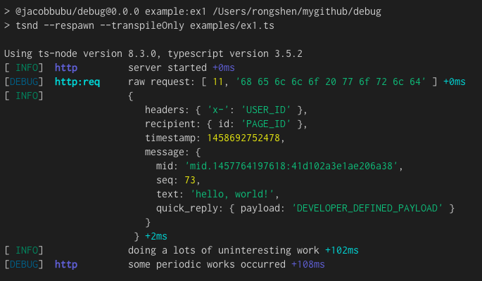

# @jacobbubu/debug

Yet another [debug](https://github.com/visionmedia/debug) module written in typescript.

## Install

```b ash
npm install
```

## Run Example

``` bash
npm run example:ex1
```

Got the output:


